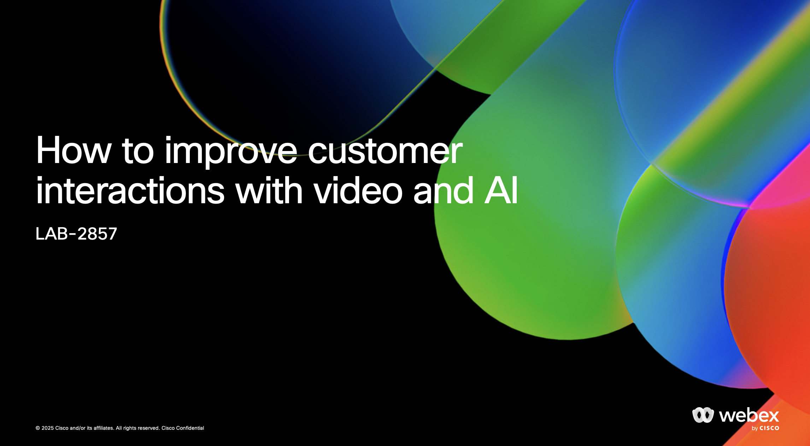
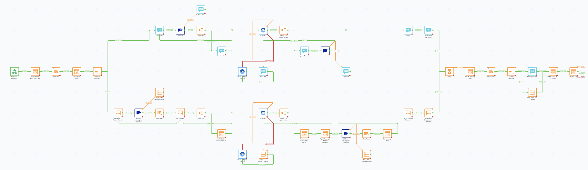

# Introduction

Welcome to the **How to improve customer interactions with video and AI** hands-on lab!

## Objectives

At the end of this lab, you should be able to build a Webex Connect flow, ready to be used for a real business use case.

{style="width:800px; display:block; margin:0 auto;"}

In the process, you will:

- Learn about Instant Connect and APIs

- Learn advanced Webex Connect integration and messaging capabilities

- Learn how to build a Webex AI Agent
