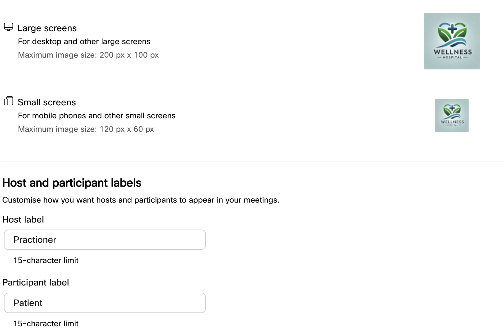

# Webex Instant Connect configuration

1. Open a browser and, go to https://instant.webex.com and Click on **Begin Integration**.

2. Log in as a Webex administrator in your Webex Meetings Guest-2-Guest organization with the lab credentials provided

3. Check that Instant Connect is activated.

      Now we are ready to use the Webex Instant Connect API! In this lab you will learn how to do it both manually,  and also automatically using Webex Connect.

      You can also configure Instant Connect appearance by adding your organization name and logo. This has been already done for you, have a look:

4. Go to **Appearance**, here is where you could change the **Organization Name**, the **logo**, and the label used for the expert/host and the customer/participant:

      {style="width:900px; display:block; margin:0 auto;"}

5. Go to **Feature Customization**. Here, you can enable or disable some of the features for your meetings with only one click, making Instant Connect a flexible and easy-to-customize solution:

      {style="width:900px; display:block; margin:0 auto;"}

Do not change any of these options for now