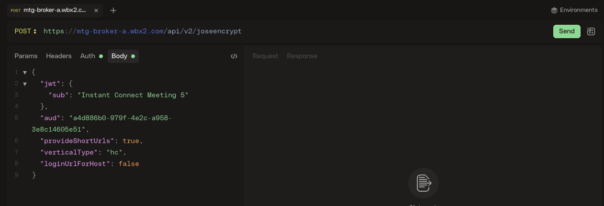

# Instant Connect API

Now, let's build the Instant Connect (IC) meeting links programmatically.

## Get an Access Token

You will need a Webex API access token to make calls to the IC API. You have two options:

* Your personal token for development purposes.

* A bot token for production use.

In this lab we will use a bot token.

## Create your BOT

1. Go to [Webex Developer Portal](https://developer.webex.com/docs/bots), log in as a Webex administrator in your **Webex Meetings Guest-2-Guest organization** with the lab credentials provided, and click on **Create a Bot**.

2. Select a unique Bot name (for example 'Video Expert PODX' where X is your POD number), and an icon of your choice. 

3. Choose your bot username, this has to be unique. For example, you could do something 'lab-wx1-PODX', where X is your POD number.

4. **App Hub Description**: we won't be publishing this bot to App Hub, but it is a good practice to add a meaningful description that will help you remember the purpose of the bot. For example, you can type something like '_This is the bot used for my wx1 lab 2857_'

5. Click on **Add Bot** and **Copy your token!!** to a safe place, we will use later:


## Create the Meeting Links

This section will provide meeting links for host (expert) and guest (end customer) users. You can use curl for this:

1. Open a text editor.

2. Copy and paste:

    ```
    curl --location 'https://mtg-broker-a.wbx2.com/api/v2/joseencrypt' \
    --header 'Content-Type: application/json' \
    --header 'Authorization: Bearer YOUR_BOT_TOKEN_HERE' \
    --data '{
        "jwt": {
            "sub": "Instant Connect Meeting 5"
        },
        "aud": "a4d886b0-979f-4e2c-a958-3e8c14605e51",
        "provideShortUrls": true,
        "verticalType": "hc",
        "loginUrlForHost": false
    }'
    ```

    Body details:

    * `sub` (Subject) string value can be whatever you like as long as it is unique for each meeting.

    * `aud` indicates the audience for which the jwt is intended. In this case it is Cisco, and the value is always the same.

    * `jwt` with `sub` and `aud` are mandatory parameters, the rest are optional.

    * `provideShortUrls`: Default: `false`. If set to `true`, the response will have shortened data portions of the meeting URL. It will also contain a shortened base URL, you will learn later how to use this data.

    * `verticalType`: Default: `hc`. Currently takes two values, `gen` for general flow, and `hc` for healthcare flow.

    * `loginUrlForHost`: Default `true`. Relevant only if `provideShortUrls` is true. If set to `false`, the short URL for hosts will be non-login links which means the host won't have an option to login for the meeting.


3. Replace _YOUR_BOT_TOKEN_HERE_ with your Bot Token.

4. Select all the text that you have now in the text editor and copy it.

5. Open a Terminal session

6. Paste the content of the clipboard and and press enter
    
    API response should be something like this:
    
    ```js
    {
        "host": [
            {
                "cipher": "eyJwMnMiOiJpNmZta3dp...cWl3ZGw2cjFuSkg0bEUj",
                "short": "oCVp2LD"
            }
        ],
        "guest": [
            {
                "cipher": "eyJwMnMiOiJEQVdaHOBS...RDTvlZ-aLLRdIMSmCwEc",
                "short": "ckmNR7I"
            }
        ],
        "baseUrl": "https://instant.webex.com/visit/"
    }
    ```
    > **Note:** Response has been formatted to make the documentation more understandable

    API Response may be difficult to read, but all the needed values should be there: _baseUrl_, _host.short_ and _guest.short_. If you prefer to use a more graphical tool, you can use Postman, Bruno, or https://httpie.io/app:

1. Open a browser tab and go to https://httpie.io/app. Click on **Close**

2. Go to the API Request URL field:

    

    and paste the content of your text editor. This should import the curl request into httpie. Click on **Update**

3. You API Request should be now ready, click on **Send**:


    

    The response should be easy to read, let's see how to create the meeting links

## Construct the Meeting URLs

Forming the meeting links is as simple as taking the `baseUrl` value and concatenating the values in `short`.

In this example, `https://instant.webex.com/visit/oCVp2LD` for the host and `https://instant.webex.com/visit/ckmNR7I` for the guest.

Now you only need to share the host URL with the expert providing support, and the guest URL with the end customer asking for support !!

This can be done by email, SMS, be integrated into some web portal, CRM, EMR, etc. In the next steps, you will learn how to do it in a digital channel like SMS using Webex Connect.


