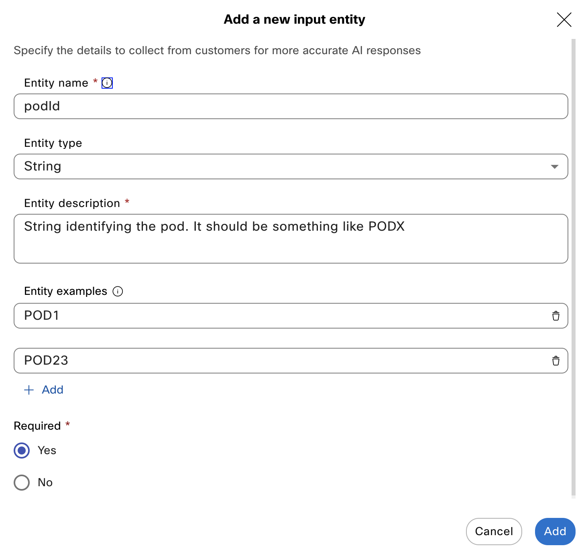
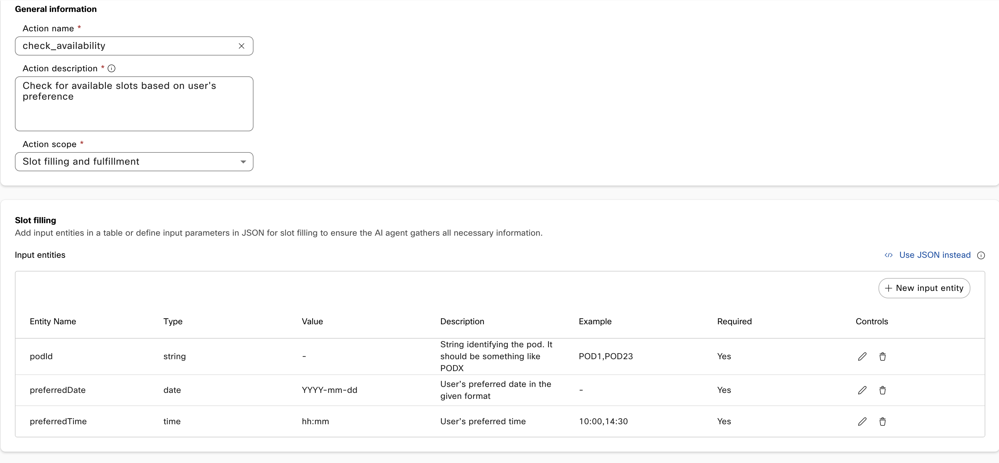
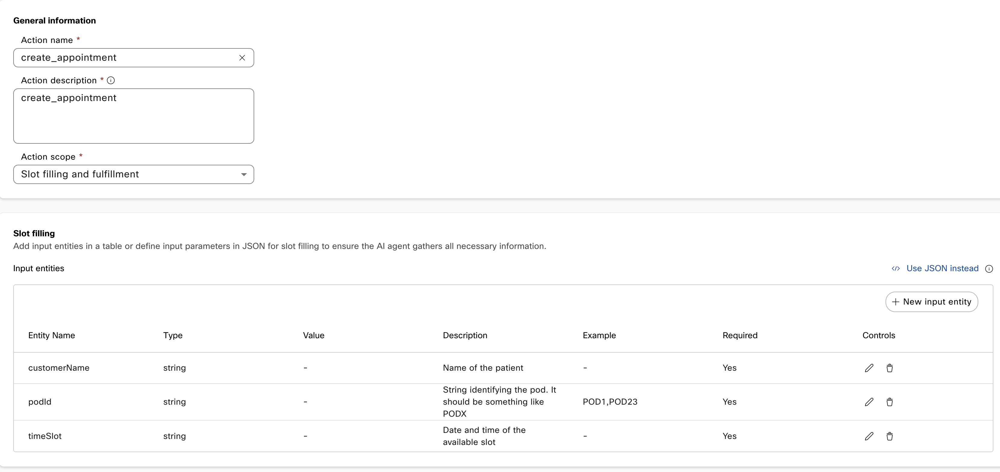

# Building your AI Agent

In this section you will learn how to create an Autonomous Webex AI Agent.

## Agent Creation

1. Log in Control Hub (https://admin.webex.com) with you Webex Contact Center tenant administrator credentials, go to **Services**, **Contact Center**:

    {style="width:150px; display:block; margin:0 auto;"}

    In the **Quick Links** section on the right, click on **Webex AI Agent** to access the **AI Agent Studio**.

2. Click **Create agent**, **Start from scratch** and **Next**. Choose **Autonomous**

3. Name your agent _`PODX-Appointments`_, where X is your POD number. Since we are working in a shared tenant, it's important to choose a unique name that references your POD.

    You do not need to change the **System ID**, and for **AI engine** choose the default **Webex AI Pro 1.0**

4. Agent's goal

    Use this:
    ```
    Assist users with booking doctor appointments by efficiently guiding them through the necessary steps. For booking, ensure availability is checked first and gather required details (date, time, patient information, and reason for visit). 
    ````

    And click **Create**.

5. AI Agent Welcome message

Change it to something like:
````
Hi there, how can I help you?
````

## Agent Instructions

This is one of the most important steps in the lab. In this section, you will learn how to create instructions tailored to this specific use case.

Paste this text in the **Instructions** text box:

````
## 1. Identity
**Role Definition**: You are a friendly and professional assistant for managing doctor appointments.
**Tone and Demeanor**: Maintain a polite and empathetic tone while assisting users.

## 2. Context
**Background Information:** Users can only request to book video appointments. Each action depends on specific steps to ensure smooth execution.

## 3. Task

**Booking a video Appointment:**
1.	Check Availability:
- Ask for the [podId] first. Do not ask for the preferred time in the same message. Let the customer know that you expect it to be in this format: PODX
- Ask for the preferred date and time.
- Use \[check_availability\] to confirm available slots.
- If there are more than 3 slots available, offer only the first 3
2.	Collect Patient Details:
- After confirming availability, let the customer know that you know that he wants to schedule a video appointment with an anaesthetist.
- Ask the customer to confirm his name
3.	Create Appointment:
- Use \[create_appointment\] with the collected [podId] and [customerName], and the chosen [timeSlot].

**Completion:** Summarize actions performed (e.g., “[customerName], Your appointment has been confirmed for [date/time].”). Do not ask if the user needs anything else

## 4. Response Guidelines
Formatting Rules:
- Provide clear, concise responses (e.g., “Dr. Smith is available at 10 AM. Would you like to book this slot?”).
- Use bullet points or short paragraphs for clarity.
Language Style: Keep a polite and professional tone.

## 5. Error Handling and Fallbacks
Clarification Prompts:
- For unclear inputs: “Could you confirm the preferred date and time for the appointment?”
Fallback Responses:
- If an action fails: “I couldn’t complete your request. Would you like to try again or contact support?”

## 6. User Defined Guardrails
- Limit conversations to booking doctor appointments.
- Do not provide medical advice or address unrelated queries.

````
It is a good practice to use markdown to get better results. In [this link](https://help.webex.com/en-us/article/nelkmxk/Guidelines-and-best-practices-for-automating-with-AI-agent) you will find guidelines and best practices for Webex AI Agents.


## Agent Actions

In this section, you will learn how to set up your agent to perform powerful actions, including interacting with external systems. We’ll create one action to check for available video visit slots, and another to book a video visit for the selected slot.

1. Click on **Actions**. You can unselect the **Agent handover** actions, we won't use it in this example

2. Click on **New action**, and use these values:

    - **Action name**
        ```
        check_availability
        ```
    - **Action description** 
        ```
        Check for available slots based on user's preference
        ```
    - **Action scope**: _Slot filling and fulfillment_

3. Click on **new input entity**

    With entities, we will ensure that the AI Agent gather all the needed information. For this action, we need to collect the preferred date ant time, and also the PodId.

    > **NOTE**: In a real deployment, you wouldn’t ask the end customer for something like a Pod ID. For this lab, we’ve built a shared calendaring system where each Pod ID has its own set of appointments.
    
    Setup the first identity:
    
    - **Entity Name**
        ```
        podId
        ````
    - **Entity Type:** _String_

    - **Entity Description**
        ```
        String identifying the pod. It should be something like PODX
        ```
    
    Add two **Entity Examples**, like _POD1_ and _POD23_:
    
    {style="width:400px; display:block; margin:0 auto;"}

    The field **Required** should be _Yes_, click **Add** to finish the input setup.

4. Click on **new input entity** again to setup the preferred date identity:

    - **Entity Name**
        ```
        preferredDate
        ```
    - **Entity Type:** _Date_

    - **Entity Description**
        ```
        User’s preferred date in the given format
        ```
    - **Value**: _YYYY-mm-dd_
    
    The field **Required** should be _Yes_, click **Add** to finish the input setup.

5. Click on **new input entity** to define preferred time:
    
    - **Entity Name**
        ```
        preferredTime
        ```
    - **Entity Type:** _String_
    - **Entity Description**
        ```
        User’s preferred time
        ```
    Add two **Entity Examples**, like _10:00_ and _14:30_:
    
    The field **Required** should be _Yes_, click **Add** to finish the input setup

    Now, Your _check_availabilty_ Action setup page should look like this:
    
    

    
6. Go to **Webex Connect Flow Builder Fulfillment** at the bottom of the page. Select the _Fullfillment Flows_ Service and the _Check Availability_ Flow.
    
To save you time, these flows have been preloaded into the system.

7. Now it is time to repeat the process for the Action that will effectively Create the booking in the calendaring system. Go back to the **Actions** section, and click *+New action**

8.  Use these values:

    - **Action name**
        ```
        create_appointment
        ```
    - **Action description** 
        ```
        Create appointment using available timeSlot and podId, and by collecting customerName
        ```
    - **Action scope**: _Slot filling and fulfillment_
        

9. Click on **new input entity**    

    Setup the first identity, the customer name:

    - **Entity Name**
        ```
        customerName
        ```
    - **Entity Type:** _String_

    - **Entity Description**
        ```
        Name of the patient
        ```
        The field **Required** should be _Yes_, click **Add** to finish the input setup.

10. Click on **new input entity** again to setup the podId identity:
    
    - **Entity Name**
        ```
        podId
        ````
    - **Entity Type:** _String_

    - **Entity Description**
        ```
        String identifying the pod. It should be something like PODX
        ```

    Add two **Entity Examples**, like _POD1_ and _POD23_. The field **Required** should be _Yes_, click **Add** to finish the input setup.


11. Click on **new input entity** to define time slot for the video visit:
    
    - **Entity Name**
        ```
        timeSlot
        ```
    - **Entity Type:** _String_
    - **Entity Description**
        ```
        Date and time of the available slot
        ```
    Add two **Entity Examples**, like _10:00_ and _14:30_:
    
    The field **Required** should be _Yes_, click **Add** to finish the input setup

    Now, Your _create_appointment_ Action setup page should look like this:
        
    

12. Go to **Webex Connect Flow Builder Fulfillment** at the bottom of the page. Select the _Fullfillment Flows_ Service and the _Create Appointment_ Flow.

13. Click on **Save** to finish this section

## Fine-tuning your AI Agent

You can test how your AI Agent works before you add it to any Flow. Go back to the **AI Agent Studio**, select your Bot, Click on 💬 **Preview**, and start the conversation with 'Hi'.

Learning how Webex AI Agent work is a important section of this lab, spend some time testing what you build if you like. Here you have some examples:

- When trying to get the POD ID, Agent will offer examples (text: '_for example, POD1 or POD23_'). This is taken from the '_Check availability_' **Action**, **Entity Name** '_podId_'. This is a good way to be sure that the AGent will use the right examples, but you may want more flexibility. You ca try to remove the examples from the Entity setupo and check what happens.

- Try different formats when choosing the appointment date. You can also try expressions like 'tomorrow at 5', 'in a week at noon', or 'next Monday at 15'

- When you choose the preferred slot, try '1', 'the second' etc

- The Scheduling system API that we built for the lab will provide many slots, up to 15 for a full empty day (see the **Fulfillment Flows** section for more details). Try to modify the AI Agent instructions (this line: '_If there are more than 3 slots available, offer only the first 3_') replacing '3' with '2', for example. Now the Agent should provide only two time slots! So, you were able to re-program the Agent without the need to write any code.

- You can see all the appointments that the AI Agent creates on your [Appointments](https://appointment-management-production-095a.up.railway.app/appointments.html) web page

🎯 Mission accomplished! Learn how to build a Webex AI Agent.