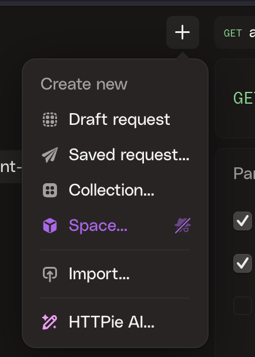
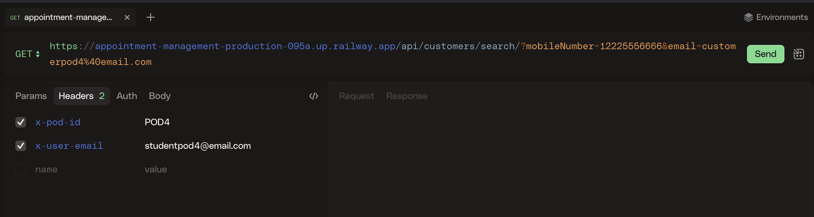

# Backend Preparation

One of the objectives of this lab is to demonstrate how Webex Connect can retrieve and update relevant business information from backend systems such as databases, CRMs or EMRs.

You have access to a mock up database for every POD where you can provision your own customers.

## Access your Customer Database

Go to this [link](https://appointment-management-production-095a.up.railway.app/database.html), use your POD number (for example _POD4_) and an attendee email address (for example _studentpod4@email.com_). Click on '_Manage my Customers_' to move on.

> NOTE: this attendee email address can be any, it won't be used later in the flow. It is used to keep POD's information isolated: you will have access only to your own customers, other lab attendees won't see your customer data. Do not share this email address with other lab attendees !!

## Create a customer

Click **Add New Customer**, type **Name**, **Email** and **Mobile Number**. **Phone** and **Company** are not mandatory and won't be used during the lab, you can add some values for demo purposes.

- <ins>ATTENDEES WITH A US MOBILE NUMBER</ins>

      **Mobile Number** has to be **real** (do not add '+' sign), **Email** can be any, for example _customerpodX@email.com_, where X is your pod Number.

- <ins>ATTENDEES WITHOUT A US MOBILE NUMBER</ins>

      We will be sending Webex message to the customer, therefore **Email** has to be the email address for a real Webex user account.
      **Mobile Number** can be anything.

## Check your Database record

You can get your new customer details using this API request:

```
curl --request GET \
  --url 'https://appointment-management-production-095a.up.railway.app/api/customers/search/?mobileNumber=12225556666&email=customerpod4%40email.com' \
  --header 'content-type: application/json' \
  --header 'x-pod-id: POD4' \
  --header 'x-user-email: studentpod4@email.com'

```

1. Import this CURL request into httpie, Bruno or Postman. If you are using httpie, click on the '+' sign and choose Import:

      {style="width:300px; display:block; margin:0 auto;"}

2. Click on 'Text', and paste the copied CURL request:

      {style="width:900px; display:block; margin:0 auto;"}

3. Click on '_Next..._' and then on '_Import_'

4. In _Headers_, user you POD number and attendee email. In the request URL (_https://appointment-management-production-095a.up.railway.app/api/customers/search/?mobileNumber=12225556666&email=customerpod4%40email.com_), replace 12225556666 with the customer mobile number, and customerpod4%40email.com with the customer email.

5. . Click on send, the response should look like this:

      ```
      {
         "podId":"POD4",
         "userEmail":"studentpod4@email.com",
         "adminMode":false,
         "searchCriteria":{
            "email":"customerpod4@email.com",
            "mobileNumber":"12225556666"
         },
         "searchScope":"user_customers",
         "matchingCustomers":[
            {
               "id":"791b0fe8-b5aa-4e18-8eb6-2076d3d20d8c",
               "name":"Customer Pod4",
               "email":"customerpod4@email.com",
               "phone":"",
               "mobileNumber":"12225556666",
               "company":"",
               "status":"active",
               "createdBy":"studentpod4@email.com",
               "createdAt":"2025-07-28T20:39:38.171Z",
               "updatedAt":"2025-07-28T20:39:38.171Z"
            }
         ],
         "totalMatches":1,
         "totalSearched":1
      }
      ```


