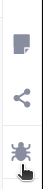

# Add the Webex AI Agent to the main Flow

In this section you will learn how to add a Webex AI agent into any Connect Flow to serve digital channels. You will do it step by step to understand the process.

## AI Agent Node

1. Go back to Webex Connect, click on **Services**, select your POD, access your Flows and select your '_Healthcare Main Flow_' Flow. Create a **Custom Variable**, name it _messageToAgent_ and choose _'Hi'_ as the **Default Value**

    You can configure your Custom Variables in Settings, on the top-right part of the screen:

    {style="width:600px; display:block; margin:0 auto;"}

2. Go the Node Pallette on the left side of the screen, select the _AI Agent_ node:

    {style="width:300px; display:block; margin:0 auto;"}

    and add it to the Canvas. Connect it to the Branch Node named 'Yes or No' (after the Branch node):
    
    {style="width:800px; display:block; margin:0 auto;"}

3. Double click on the node to set it up:

    {style="width:800px; display:block; margin:0 auto;"}

    On the **AGENT** drop-down menu, choose the AI Agent that you have created (podX-AIAgent). Notice that the _messageToAgent_ Custom Variable will trigger the Agent. Click on **Save**.

## Working with end customer messages

1. Now the next step is to use the response generated by the Agent and send it back to the customer.
    - Select any of the SMS Nodes that you already have in the flow, copy and paste it.
    - Connect it to the AI Agent Node, choosing the _onSuccess_ **Event**.
    - Double click on this new SMS Node to set it up.
    - Rename it to something like _Agent Message_, and choose these values:

        > NOTE: as **From Number** you can choose any of the two numbers available. Once you choose one, use always the same. Do not use 'CONNCT'.

    {style="width:800px; display:block; margin:0 auto;"}

    Depending on the order you followed during the lab, what you see on the screen might be slightly different. Normally, you will see the AI Agent node as the last one in the list of nodes on the right. Remember that you can always check the node numbers by clicking the **Debug** button.

    {style="width:80px; display:block; margin:0 auto;"}

    Click **Save**.

2. Select any of the Receive nodes that you already have in the flow, copy and paste it. Connect it to the 'Agent Message' previous SMS Node.

3. This Receive Node will get the end customer question/message. Now we need to send it back to the Agent. Double click the Receive Node, and add a Transition Action like this:

    {style="width:800px; display:block; margin:0 auto;"}

    Be sure that the variable node number (97 in this example in `$(n97.receive.message)` ) is the same as the Receive Node number at the bottom left. With these steps, you will be taking the customer SMS message text and sending it back to the AI Agent.

4. Select the **Receive Node** Outcome (green circle), and connect it to the AI Agent Node. You should get something like this:

    {style="width:800px; display:block; margin:0 auto;"}

    If you tested now the Flow it would work, but the conversation would never end. We need to add a way to determine that the video visit was scheduled, and move to the next step which is sharing a video with the end customer. You will do it now:

## Ending the conversation with the AI Agent

1. Remove the connection between the AI Agent Node, and the 'Agent Message' SMS Node. You do this by selecting the connection and clicking on the **Delete** button on the bottom of the Flow Editor canvas.

2. Add a new Branch Node, connect it to the AI Agent Node (_on_Success_ branch), and configure it like this:

    {style="width:800px; display:block; margin:0 auto;"}

3. Connect this 'Check if AI Agent is done' **Branch Node** to the existing **SMS node** named 'Thanks'. Choose the _Yes_ **Event**.

4. Go back to the 'Check if AI Agent is done' **Branch Node**, and now connect the _None of the above_ **Event** to the 'Agent Message' **SMS Node**. Now, this section of the Flow should look like something like this:

    {style="width:800px; display:block; margin:0 auto;"}

    As you can see, we didn’t build this section of the flow in the same order as the nodes appear now, but hopefully this helped you better understand the process.

    Now you only need to add error and time out control, you will do it in the following section:

## Controlling response timeouts and session errors

1. Select any of the existing 'Time Out' SMS nodes that you already have in the flow, copy and paste it. Connect it to the Orange output (On Timeout) of the **Receive Node** you recently added.

2. Paste one more 'Time Out' SMS node, and connect it to the Orange output (On Timeout) of the **AI Agent Node**.

3. Add a new **AI Agent Node** to the Canvas. Connect all the previous AI Agent node **RED** outputs to this new AI Agent node (onInvalidData, onError, onInvalidChoice, onFailure).

4. Double click on it to set it up:

    {style="width:800px; display:block; margin:0 auto;"}

    You gave to choose your POD bot.

4. Connect the last 'Time Out' SMS node (green bubble) that you created to this 'Closing Session' **AI Agent Node**.

    This section of the flow should look like this:

    {style="width:900px; display:block; margin:0 auto;"}

    > NOTE: you could use only one 'Time Out' Node if you wanted, we chose to have two to make the flow easier to follow

🎯 Mission accomplished! Learn how to add a Webex AI Agent to a digital channel conversation.

