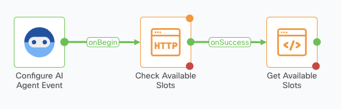
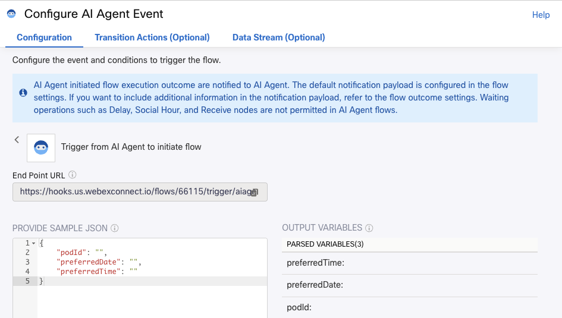
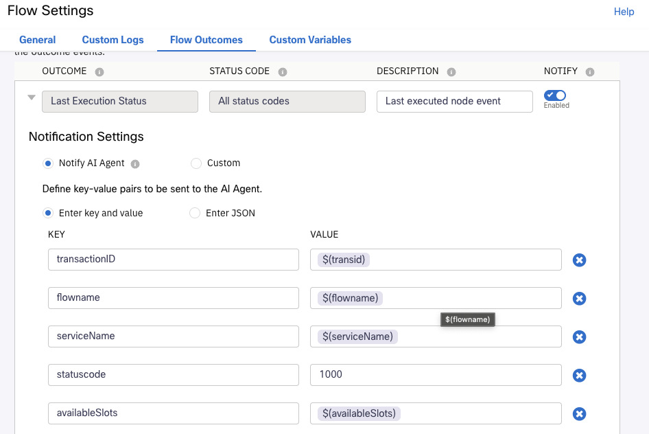
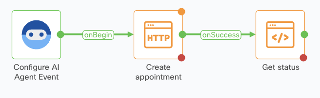
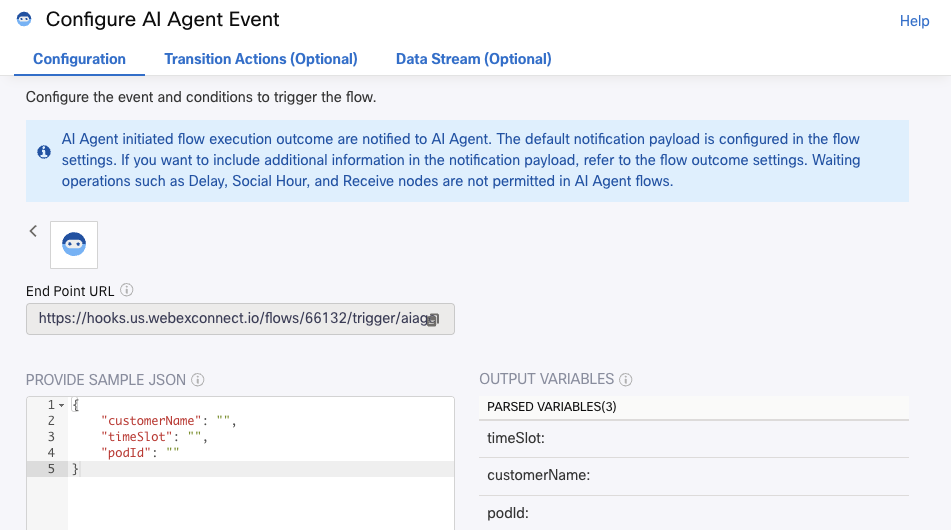

# Fulfillment Flows

These flows han been already created to save you time, let's have see how they were designed.

## Check availability Flow

{style="width:400px; display:block; margin:0 auto;"}

The flow will receive as input the POD ID, the preferred date and the preferred time:

{style="width:700px; display:block; margin:0 auto;"}

The '_Check Available Slots_' **Http Request Node** will get the available slots, that could be many. This is an example of the API response for a full empty day:

```js
{
  "podId": "POD1",
  "searchCriteria": {
    "date": "2025-09-25",
    "startTime": "09:00",
    "endTime": "17:00",
    "duration": 60,
    "interval": 30
  },
  "availableSlots": [
    {
      "startTime": "2025-09-25T09:00:00.000Z",
      "endTime": "2025-09-25T10:00:00.000Z"
    },
    {
      "startTime": "2025-09-25T09:30:00.000Z",
      "endTime": "2025-09-25T10:30:00.000Z"
    },
    {
      "startTime": "2025-09-25T10:00:00.000Z",
      "endTime": "2025-09-25T11:00:00.000Z"
    },
    {
      "startTime": "2025-09-25T10:30:00.000Z",
      "endTime": "2025-09-25T11:30:00.000Z"
    },
    {
      "startTime": "2025-09-25T11:00:00.000Z",
      "endTime": "2025-09-25T12:00:00.000Z"
    },
    {
      "startTime": "2025-09-25T11:30:00.000Z",
      "endTime": "2025-09-25T12:30:00.000Z"
    },
    {
      "startTime": "2025-09-25T12:00:00.000Z",
      "endTime": "2025-09-25T13:00:00.000Z"
    },
    {
      "startTime": "2025-09-25T12:30:00.000Z",
      "endTime": "2025-09-25T13:30:00.000Z"
    },
    {
      "startTime": "2025-09-25T13:00:00.000Z",
      "endTime": "2025-09-25T14:00:00.000Z"
    },
    {
      "startTime": "2025-09-25T13:30:00.000Z",
      "endTime": "2025-09-25T14:30:00.000Z"
    },
    {
      "startTime": "2025-09-25T14:00:00.000Z",
      "endTime": "2025-09-25T15:00:00.000Z"
    },
    {
      "startTime": "2025-09-25T14:30:00.000Z",
      "endTime": "2025-09-25T15:30:00.000Z"
    },
    {
      "startTime": "2025-09-25T15:00:00.000Z",
      "endTime": "2025-09-25T16:00:00.000Z"
    },
    {
      "startTime": "2025-09-25T15:30:00.000Z",
      "endTime": "2025-09-25T16:30:00.000Z"
    },
    {
      "startTime": "2025-09-25T16:00:00.000Z",
      "endTime": "2025-09-25T17:00:00.000Z"
    }
  ],
  "totalSlots": 15
}
```
As you saw in the previous **Building your WEbex AI Agent** section, AI Agent is able to offer only the first 3 available slots using a simple instruction.

The result of a fulfillment Flow is defined in **Flow Settings** ⚙️ , **Flow Outcomes**, **OUTCOME**, **Last Execution Status** :

{style="width:700px; display:block; margin:0 auto;"}


## Create appointment Flow

{style="width:400px; display:block; margin:0 auto;"}

The flow will receive as input POD ID, the Customer Name and the date for the appointment:

{style="width:700px; display:block; margin:0 auto;"}

The '_Create appointment_' **Http Request Node** will create the appointment in the calendar system.