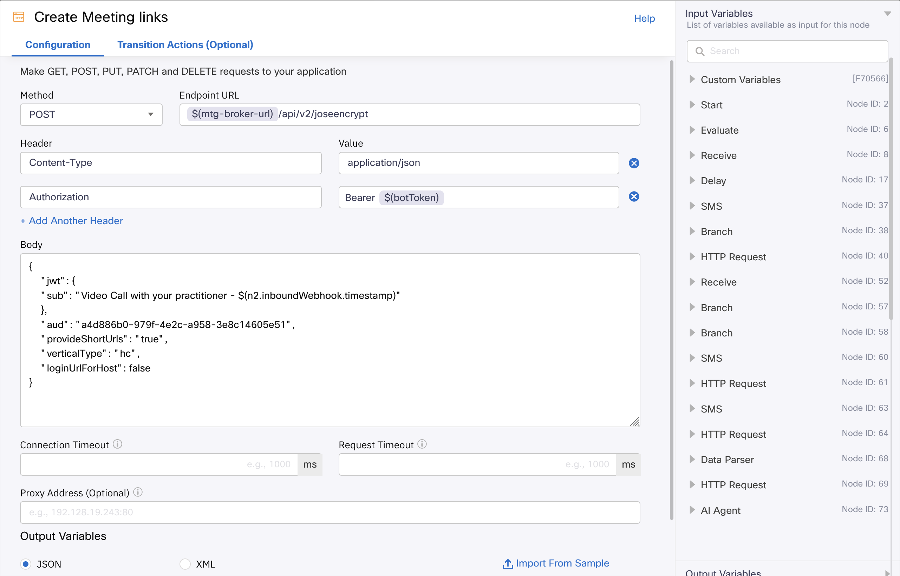
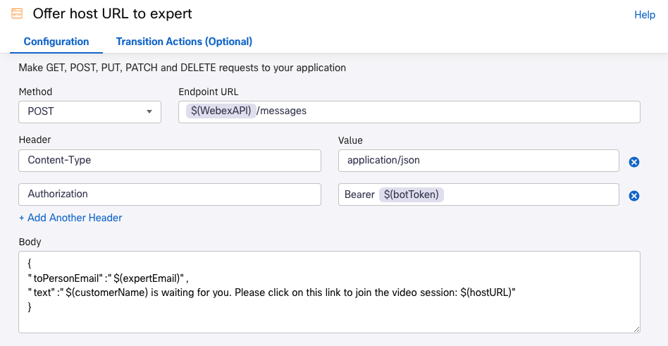

# Create and share Instant Connect Meeting Links

## Create Meeting Links

Similarly to what we did previously in the **Webex Instant Connect API** section , here we will create Webex Instant Connect meeting links.  However, instead of using curl/httpie we will use an **HTTP Request** node. 

1. Go back to Webex Connect, and click on **Services**. Select your POD, access your Flows and then your 'Healthcare Main Flow' Flow. Click on the **Settings** wheel on the top right, and then **Custom Variables**. Find the variable named _botToken_ and paste the value of the BOT token created in the _Instant Connect API_ previous section.

2. Add a new **HTTP Request** node to the canvas, and connect it to the  **Delay** node orange dot. You should find the **Delay** node almost at the end of the Flow:

    {style="width:600px; display:block; margin:0 auto;"}

    Configure the node as shown below:

    {style="width:900px; display:block; margin:0 auto;"}

    Here you have some of the values that you can copy-paste:

    - Endpoint URL:
        ```
        $(mtg-broker-url)/api/v2/joseencrypt
        ```
    - Body: 
        ```
        {
            "jwt": {
            "sub": "Video Call with your practitioner - $(n2.inboundWebhook.timestamp)"
            },
            "aud": "a4d886b0-979f-4e2c-a958-3e8c14605e51",
            "provideShortUrls": "true",
            "verticalType": "hc",
            "loginUrlForHost": false
        }
        ```

        With the option `verticalType` = `hc` , Instant Connect user interface will be automatically customized for a Healthcare use case.

    - Rename the node to 'Create meeting links' and **Save** it

3. Add a **Data Parser** node to the canvas, and connect it to the previous **HTTP Request** node.

    - To get the value for **Input: Import Data From**, choose the `http.responseBody` variable from the `Create Meeting Links` **HTTP Request** node configured in the previous step:

    {style="width:800px; display:block; margin:0 auto;"}

    > **Note:** Node numbers may be different.

    - For the **Sample Body**, you can use the response body you got with curl, ot use the **HTTP Request** Node embedded _Test_ option.

        Here you have on example that you can copy and paste:
        ```
        {
            "host": [
                {
                    "cipher": "eyJwMnMiOiJpNmZta3dp...cWl3ZGw2cjFuSkg0bEUj",
                    "short": "oCVp2LD"
                }
            ],
            "guest": [
                {
                    "cipher": "eyJwMnMiOiJEQVdaHOBS...RDTvlZ-aLLRdIMSmCwEc",
                    "short": "ckmNR7I"
                }
            ],
            "baseUrl": "https://instant.webex.com/visit/"
        }
        ```

    - Click on **Parse**

    - In this case you do not need to **Select** and **IMPORT** all the variables, `$.baseUrl`, `$.host[0].short` and `$.guest[0].short` are enough.

        Set the **OUTPUT VARIABLE NAMES** as shown below:

        {style="width:600px; display:block; margin:0 auto;"}

        And **Save** the node.

4. Next, we will build variables containing the host and guest URLs. We can use again the embedded capabilities of Webex Connect nodes for this:

    - Edit the  **Data Parse** node we just created, and go to the **Transition Actions (Optional)** tab.

    - Add an Action and set the value for two **Custom Variables**: `guestURL` and `hostURL`.

        The URL values are created by concatenating the `baseUrl` and the values in the `short` and `guest` keys on node leave.
            
        {style="width:800px; display:block; margin:0 auto;"}

    > **Note:** Node numbers may be different.

    Click **Save**.

## Send link to customer

 1. Connect the Data Parser node to the 'Channel Selection' Branch Node that you should have at the end of the flow:

    {style="width:700px; display:block; margin:0 auto;"}

 2. Double click on the SMS node named 'Send guest URL', and check the variable $(guestURL) is used to send the link to the customer.

## Send link to expert

Next, we will use the [Webex messaging API](https://developer.webex.com/docs/api/v1/messages/create-a-message) to send a message from your Webex bot to the expert.

1. Choose your expert

    Go back again to **Custom Variables** (under the **Settings** wheel), and type the expert email address. This has to be the email address for a real Webex user account.

    In a real project, normally there will be a process or system in place to choose the best expert for a given customer or interaction. In this case, the expert is a static value.


    - <ins>ATTENDEES WITHOUT A US MOBILE NUMBER</ins>

        Because you may have used your regular Webex user account email address for the customer in the previous **Backend Preparation** section, you will need a second one for the expert. If you already have one, use it. If you do not, you can create one in [here](http://web.webex.com) (_Sign Up_ option), or if you prefer you can use your admin user (admin-podX@ai-services-lab.wbx.ai).

2. Add an **HTTP Request** node to the canvas, and connect it to the previous **SMS** node named _'Send guest URL'_.

    - Configure the node as shown below:

        {style="width:800px; display:block; margin:0 auto;"}

        Here you have some of the values that you can copy-paste:

        - Body:
            ```
                {
                    "toPersonEmail":"$(expertEmail)",
                    "text":"$(customerName) is waiting for you. Please click on this link to join the video session: $(hostURL)"
                } 
            ```
    
    - Rename the node to 'Offer host URL to expert' and **Save** it

    🎯 Mission accomplished! Learn how to integrate Webex Connect with Instant Connect to create the Instant Connect Meetings Links, and share them with the customer and the expert.

## SECTION FOR NON US ATTENDEES

If you do not have a US mobile number, you can still test your flow.

1. Go to the _Channel Selection_ **Branch Node** at the beginning of the Flow, and connect the 'Webex' outcome to the **HTTP Request Node** named _Reminder-Webex Channel_:
    
    > Note: You may need to zoom out and go to the beginning of the flow)


    {style="width:900px; display:block; margin:0 auto;"}

    The Webex AI Agent has been added in this Webex flow branch for you, you do not need to to it again. Now please go to the end of the flow, and connect the output of the '_Send guest URL - Webex_' node to the '_Offer host URL to expert_' node.

    You need to follow some more steps in order to use Webex as the channel for this use case:

2. At the left side Webex Connect menu bar, click on **Assets** and **Integrations** (Save your Flow first!)

3. Click on **Add Integration** and choose **Inbound Webhook**

4. Choose a unique name, for example _listener_podX_, where X is your POD number.

5. Copy the WebHook URL in a safe place (we will use ```https://hooks.us.webexconnect.io/events/ASKAS3CYE5``` in this example)

6. Click on the **Paste JSON tab**, and paste:
    ```
    {
        "id": "",
        "name": "",
        "targetUrl": "",
        "resource": "",
        "event": "",
        "orgId": "",
        "createdBy": "",
        "appId": "",
        "ownedBy": "",
        "status": "",
        "created": "",
        "actorId": "",
        "data": {
            "id": "",
            "roomId": "",
            "roomType": "",
            "personId": "",
            "personEmail": "",
            "created": ""
        }
    }
    ```


7. Click on **Parse** and **Save**

8. Create a Webhook associated to your Bot. This Webhook will be 'listening' to all the messages sent to the Bot

    - Copy this CURL request:

        ```
        curl --request POST \
        --url https://webexapis.com/v1/webhooks \
        --header 'authorization: Bearer YOUR_BOT_TOKEN' \
        --header 'content-type: application/json' \
        --data '{
        "name": "Webex listener PODX",
        "targetUrl": "INBOUND_WEBHOOK_URL",
        "resource": "messages",
        "event": "created"
        }'
        ```

    - Import it into httpie, Bruno or Postman, as you did in the previous section '_Backend Peparation_'.

    - Replace _YOUR_BOT_TOKEN_ with your bot Token, _INBOUND_WEBHOOK_URL_ with URL for the Inbound Webhook created above (```https://hooks.us.webexconnect.io/events/ASKAS3CYE5``` in this example), and use your POD number:

    {style="width:900px; display:block; margin:0 auto;"}
    
    You should get a response similar to  this: 

    ```js
    {"id":"Y2lzY29zcGFyazovL3VybjpURUFNOnVzLXdlc3QtMl9yL1dFQkhPT0svZWEwMmNkOTQtOWRjMy00ODIxLWI3NzUtMzFkYjgxNWIwODk5",
    "name":"Webex listener PODX",
    "targetUrl":"https://hooks.us.webexconnect.io/events/ASKAS3CYE5",
    "resource":"messages",
    "event":"created",
    "orgId":"Y2lzY29zcGFyazovL3VzL09SR0FOSVpBVElPTi8zMThlODNmYy1mM2FiLTRlZTYtYjdjMS0yODYwOGRmNGI3MTI","createdBy":"Y2lzY29zcGFyazovL3VzL1BFT1BMRS9iMjMyZDQzZS1lZWY3LTRlMTctYjRjZC1mZGUzMDkzYWJiZTA","appId":"Y2lzY29zcGFyazovL3VzL0FQUExJQ0FUSU9OL0MzMmM4MDc3NDBjNmU3ZGYxMWRhZjE2ZjIyOGRmNjI4YmJjYTQ5YmE1MmZlY2JiMmM3ZDUxNWNiNGEwY2M5MWFh",
    "ownedBy":"creator",
    "status":"active",
    "created":"2025-09-04T13:42:44.239Z"}
    ```

9. Go back to **Services**, your POD Service, **Flows**, and Click on your '_Healthcare Main Flow_' Flow.

10. Find the two **Receive** nodes named '_Wait for message on Webhook_' and edit both of them:

    Under **Receive Custom Event**, **Custom Event**, choose the Inbound Webhook created above (_listener_podX_ in this example). Click **Save**.
    
    Make sure that these two receive nodes green outputs are connected to the next Data Parser node!
