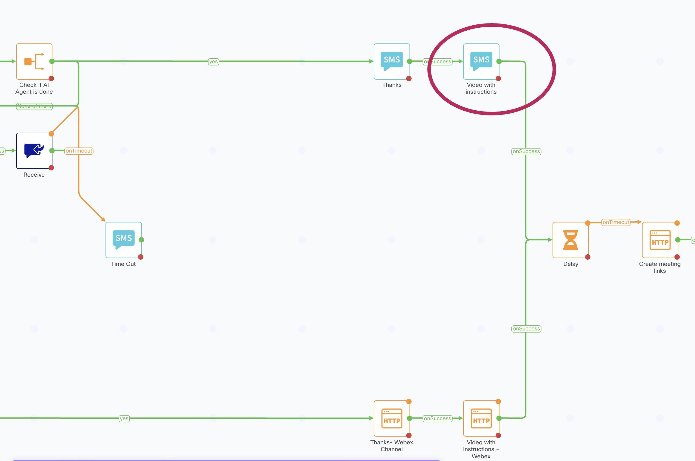
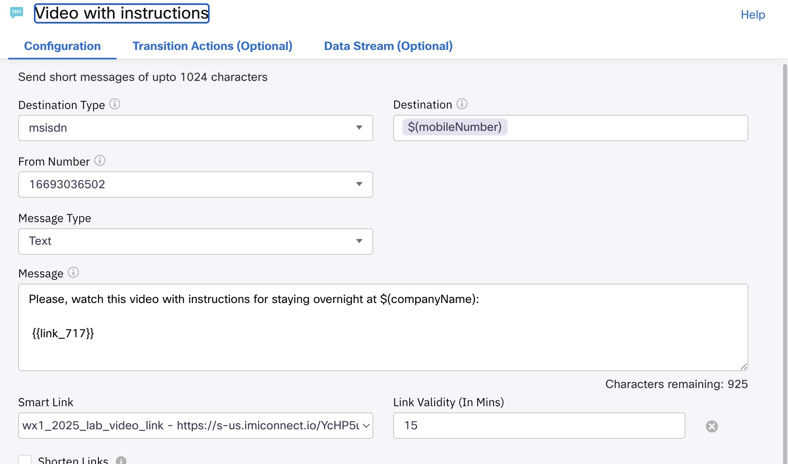

# Testing the Flow

## Configure the link for the instructions video

On Webex Connect, if you go to **Tools**, **Smart Links**, you will see that a smart link to the instructions video has been already created for you. This is another powerful Webex Connect feature, you can get more details [here](https://help.webexconnect.io/docs/smart-links). Now, you still need to use this link in your flow.

1. Go back to your Flow, and search for an SMS node '_Video with instructions_':

    {style="width:700px; display:block; margin:0 auto;"}

2. Double click to edit it, and choose the Smart Link in the _Smart Link_ drop-down menu. This should automatically add a reference to the link in the Message Text:

    {style="width:700px; display:block; margin:0 auto;"}

    Click **Save**.

## Check flow errors

- Edit all your **SMS** nodes, and choose one of the available numbers in the **From Number** drop-down menu. Choose the same for all nodes.

- Edit all the **Receive** nodes that are connected to an **SMS node**: choose the same number in the **Number** drop-down menu that you chose before. Use '\*' as **Keyword**.

> IMPORTANT !! Attendees without a US Mobile Number should skip this next step:

- Edit all the **Receive** nodes that are connected to an **HTTP Request node**: in the **Custom Event** drop-down menu, choose _all_pods_listener_.

## Publish the Flow

Click on **MAKE LIVE**, add some comments (Optional) and click on **Make Live** again.

## Trigger the Flow

1. Click on the first _Configure Webhook_ node in the flow, and copy the WebHook URL. We will use `https://hooks.us.webexconnect.io/events/TOONJ56GSA` as an example.

2. Go to [https://appointment-management-production-095a.up.railway.app/demo-start.html](https://appointment-management-production-095a.up.railway.app/demo-start.html) 

    - <ins>ATTENDEES WITH A US MOBILE NUMBER</ins>

        Type your mobile number. This has to be a real working US mobile Number, and the same one you chose as the Customer mobile number in the previous **Backend Preparation** section.

        In the _Webex Connect Webhook URL_ input filed, paste your WebHook URL (`https://hooks.us.webexconnect.io/events/TOONJ56GSA` in this example). Click **Submit**.

    - <ins>ATTENDEES WITHOUT A US MOBILE NUMBER</ins>

        Type your email address. This has to be the same one you chose as the **Customer** email address in the previous **Backend Preparation** section. You can always check your customer data [here](https://appointment-management-production-095a.up.railway.app/database.html).

        In the _Webex Connect Webhook URL_ input filed, paste your WebHook URL (`https://hooks.us.webexconnect.io/events/TOONJ56GSA` in this example. Click **Submit**.

    

## Follow the use case

Now you can interact with the flow, and check how:

- Customer name is read from the database
- AI Agent helps you choosing your preferred date fot the video visit
- Video visit is scheduled, and links are sent to customer and expert
- Customer and expert can join the video session

    To receive the message for the expert, you will need to log in [web.webex.com](https://web.webex.com) using the email address you chose as _expertEmail_ in your Flow.
    
    Attendees without a USA mobile number, will also need to log in as a customer, using the chosen customer email address.

