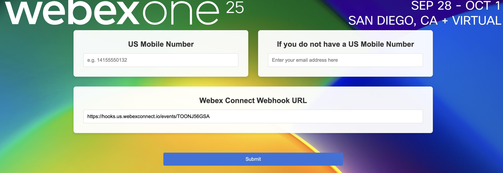

# Testing the Flow

## Check flow errors

- Edit all your **SMS** nodes, and choose one of the available numbers in the **From Number** drop-down menu.

- Edit all your **Receive** nodes, and choose one of the available numbers in the **Number** drop-down menu. Use '\*' as **Keyword**.

## Publish the Flow

Click on **MAKE LIVE**, add some comments (Optional) and click on **Make Live** again.

## Trigger the Flow

1. Click on the first _Configure Webhook_ node in the flow, and copy the WebHook URL. We will use `https://hooks.us.webexconnect.io/events/TOONJ56GSA` as an example

2. Go to https://appointment-management-production-095a.up.railway.app/demo-start.html 

    - <ins>ATTENDEES WITH A US MOBILE NUMBER</ins>

        Type your mobile number. This has to be a real working US mobile Number, the same one you chose as the Customer mobile number in the previous **Backend Preparation** section.

        In the _Webex Connect Webhook URL_ input filed, paste your WebHook URL (`https://hooks.us.webexconnect.io/events/TOONJ56GSA` in this example). Click **Submit**.

    - <ins>ATTENDEES WITHOUT A US MOBILE NUMBER</ins>

        Type your email address. This has to be the same one you chose as the **Customer** email address in the previous **Backend Preparation** section.

        In the _Webex Connect Webhook URL_ input filed, paste your WebHook URL (`https://hooks.us.webexconnect.io/events/TOONJ56GSA` in this example. Click **Submit**.

    

## Follow the use case

Now you can interact with the flow, and check how:

- Customer name is read from the database
- AI Agent helps you choosing your preferred date fot the video visit
- Video visit is scheduled, and links are sent to customer and expert
- Customer and expert can join the video session

